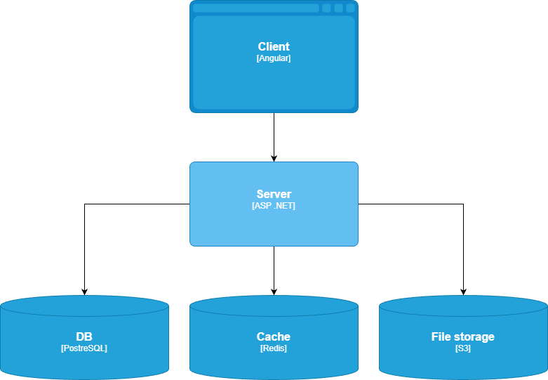

# Архитектура проекта

## Текущее состояние (на 2026-05-06)

- Архитектурный стиль: Clean Architecture (`Domain` → `Application` → `Infrastructure` → `API`).
- Источник истины по БД: SQL-скрипты в `infra/db/init` (порядок `00_…` и выше + seed в `test_data/`).
- Реализованы потоки:
  - выбор научного руководителя (`SupervisorRequests`);
  - утверждение темы (`StudentApplications`): одобрение научруком сразу переводит заявку к заведующему (`PendingDepartmentHead`); отдельного API «ручной передачи» заведующему нет;
  - чат по заявке (`ApplicationChatMessages`, REST + polling на фронте);
  - архив ВКР (`GraduateWorks`, presigned URL S3/MinIO).
- Безопасность и данные: `GET /applications/{id}` отдаёт деталь только при совпадении прав видимости с ролью (как у списка заявок), иначе 404.
- Производительность: `IMemoryCache` для резолва `ApplicationStatuses` по `code_name` (инвалидация при изменении справочника через репозиторий); интеграционные тесты сбрасывают кэш при `TRUNCATE`.
- Авторизация: JWT + refresh-токены в Redis.
- Уведомления: in-app + фоновая отправка email.
- 10 справочников с полным CRUD (см. `docs/api/v1.endpoints.md`).
- Тесты: unit + интеграционные (Testcontainers PostgreSQL/Redis).
- **Frontend (Angular 20):** общий сервис периодического опроса `DetailPollingService` для карточек заявки и запроса научрука; остальное — `FrontendDevelopmentPlan.md`.
- Запланировано: мониторинг (Prometheus + Grafana), расширение админки SPA.

## Ссылки на детальные документы

- Backend roadmap: `BackendDevelopmentPlan.md`
- Frontend roadmap: `FrontendDevelopmentPlan.md`
- Общий план проекта: `DevelopmentPlan.md`
- API index: `docs/api/README.md`
