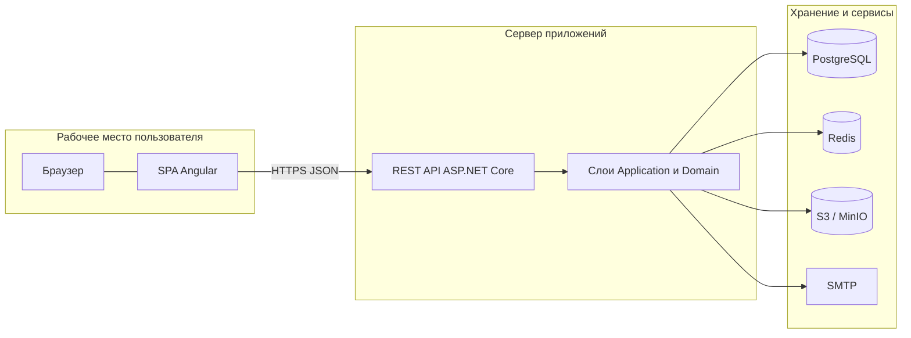
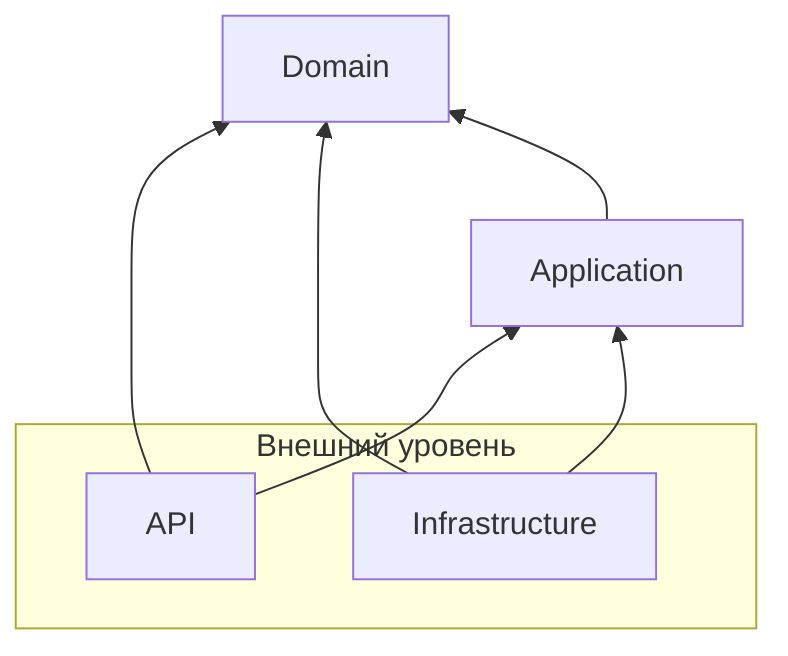
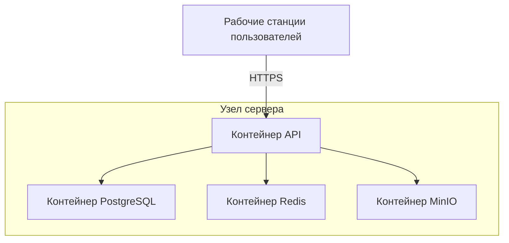

# Архитектура программно-информационной системы

## 2.1. Назначение и границы системы

Программно-информационная система (ПИС) поддерживает организационный контур выбора темы выпускной квалификационной работы (ВКР) и научного руководителя в высшем учебном заведении. В соответствии с системным анализом предметной области в процессе участвуют студент, преподаватель (научный руководитель), заведующий кафедрой и администратор; ключевые сущности — кафедра, тема ВКР, заявка студента, архив защищённых работ.

Система обеспечивает: учёт и согласование заявок по маршруту «преподаватель → заведующий кафедрой»; переписку в привязке к заявке до окончательного решения заведующего; ведение справочников (кафедры, роли, учёные степени, должности и др.); загрузку и хранение файлов архива ВКР; уведомления о значимых событиях (в том числе смене статуса заявки).

Границы решения: веб-клиент, сервер с REST API, СУБД PostgreSQL, Redis, S3-совместимое объектное хранилище, доставка уведомлений по SMTP. Интеграция с электронно-информационной средой конкретного вуза (ЭИОС), единым каталогом LDAP и корпоративным мониторингом в состав работы не входит; заложенная слоистая архитектура допускает добавление адаптеров без изменения доменных правил согласования заявок.

## 2.2. Технологический стек и обоснование выбора

Клиентская часть — одностраничное приложение (SPA) на **Angular** и **TypeScript** со стилями **SCSS**: единый интерфейс для всех ролей, маршрутизация, формы заявок и тем, HTTP-взаимодействие с API.

Серверная часть — **ASP.NET Core** и язык **C#**: REST API, внедрение зависимостей, авторизация, интеграция с ORM, документирование контрактов **Swagger (OpenAPI)**.

**PostgreSQL** используется как основная СУБД для обеспечения целостности связей и транзакционной смены статусов заявок. **Redis** применяется для данных с ограниченным сроком жизни (в частности refresh-токенов). Файлы архива и крупные вложения хранятся в **S3-совместимом** хранилище (на стенде разработки — MinIO). Уведомления дублируются записями в БД и при необходимости отправляются по **SMTP**.

Сборка и запуск серверных и инфраструктурных компонентов автоматизированы **Docker Compose**.

## 2.3. Общая архитектурная схема

ПИС построена по модели **«клиент — сервер»**: представление и ввод данных — в браузере; проверка прав, бизнес-логика, доступ к данным и внешним сервисам — на сервере; обмен по протоколу HTTPS и формату JSON.

Сервер спроектирован по принципам **чистой архитектуры (Clean Architecture)**: зависимости направлены от периферии к центру, домен не зависит от фреймворков и СУБД. Такой подход соответствует принятой в задании на ВКР постановке спроектировать приложение на основе чистой архитектуры и упрощает проверку правил переходов статусов заявки, доступа к чату и ролевой модели.

На рисунке 2.1 приведена логическая схема взаимодействия компонентов.

Рисунок 2.1 — Логическая архитектура ПИС

## 2.4. Декомпозиция на подсистемы

Функциональная структура отображает требования к автоматизации, сформулированные при анализе предметной области.

**Управление доступом и профилями** — аутентификация, JWT и обновление сеанса, авторизация по ролям, учёт пользователей и регистрация администратором.

**Справочники** — кафедры, учёные степени, должности, роли и связанные классификаторы для карточек пользователей и тем.

**Каталог тем ВКР** — создание и ведение тем научным руководителем, привязка к кафедре и учебному году, отображение доступности для студента.

**Процесс заявок** — подача заявки студентом, одобрение или отклонение преподавателем, утверждение или отклонение заведующим кафедрой, отмена на допустимых этапах; каждый шаг проверяется по роли и текущему статусу.

**Коммуникации** — сообщения, привязанные к заявке, до финального решения заведующего кафедрой.

**Уведомления** — фиксация событий и доставка пользователю (интерфейс, электронная почта).

**Архив ВКР и администрирование** — метаданные защищённых работ, файлы в объектном хранилище, выборки и экспорт для отчётности.

## 2.5. Внутренняя структура серверного приложения

Серверная часть реализована четырьмя проектами: **Domain**, **Application**, **Infrastructure**, **API**.

*Domain* — сущности предметной области, контракты аудита; отсутствуют зависимости на EF Core и ASP.NET Core.

*Application* — сервисы заявок, тем, чата, справочников, уведомлений, аутентификации; DTO; интерфейсы репозиториев и внешних сервисов; регистрация зависимостей.

*Infrastructure* — DbContext и конфигурация EF Core, репозитории, Redis, S3, SMTP.

*API* — контроллеры, маршруты `/api/v1/...`, middleware, Swagger; контроллеры вызывают сервисы *Application* без дублирования бизнес-правил.

Правило зависимостей: *API* и *Infrastructure* зависят от *Application* и *Domain*; *Application* — только от *Domain*; *Domain* автономен.

На рисунке 2.2 показано направление зависимостей между слоями.

Рисунок 2.2 — Слоистая архитектура серверной части (зависимости между проектами)

Соответствие структуре репозитория:

- `AcademicTopicSelectionService.Domain`
- `AcademicTopicSelectionService.Application`
- `AcademicTopicSelectionService.Infrastructure`
- `AcademicTopicSelectionService.API`

## 2.6. Развёртывание

Типовой учебный или пилотный контур — один хост (физический или виртуальный) с контейнерами PostgreSQL, Redis, при необходимости MinIO и образом сервера API. Клиент поставляется как статические файлы после сборки Angular либо отдаётся dev-сервером на этапе разработки. Пользователи подключаются по браузеру.

Рисунок 2.3 — Схема развёртывания компонентов (учебный стенд)

## 2.7. Основные потоки обработки данных

**Заявка.** Клиент передаёт JSON в REST API; контроллер делегирует сервису заявок уровня *Application* проверку роли, валидацию и допустимость перехода статуса; результат сохраняется в PostgreSQL с использованием транзакций при необходимости.

**Чат.** Сообщения сохраняются в БД с привязкой к заявке и автору; клиент получает историю и новые сообщения через периодические запросы к API (polling), что не требует постоянного канала WebSocket и упрощает эксплуатацию в сети вуза.

**Архив.** Двоичные файлы — в объектном хранилище; метаданные и права доступа — в PostgreSQL; операции загрузки и выдачи выполняются через API с проверкой роли администратора.

**Аутентификация.** Выдача и проверка refresh-токенов используют Redis, разгружая основную БД от краткоживущих ключей.

## 2.8. Информационное обеспечение

Персистентные данные пользователей, справочников, тем, заявок, сообщений, уведомлений и метаданных архива хранятся в **PostgreSQL**. Схема БД задаётся скриптами инициализации; модель **Entity Framework Core** согласована со схемой. Концептуальная и логическая модель с ER-диаграммой излагаются в разделе проектирования базы данных пояснительной записки.

## 2.9. Безопасность и устойчивость

Реализованы разграничение доступа по ролям на уровне API и в сервисах, аутентификация на основе JWT и механизм refresh-токенов, хэширование паролей, серверная валидация входных данных, единый формат ошибок (Problem Details), журналирование ошибок и настройка CORS для ограничения доверенных источников запросов из браузера.

## 2.10. Выводы по разделу

Спроектированная архитектура сочетает клиент-серверную модель веб-приложения с четырёхуровневой серверной структурой по принципам чистой архитектуры, покрывает подсистемы, вытекающие из предметной области и задач ВКР (заявки, чат, справочники, архив, уведомления, роли), и опирается на согласованный набор технологий: PostgreSQL, Redis, S3-совместимое хранилище, SMTP и контейнеризованное развёртывание. Это обеспечивает модульность, проверяемость бизнес-правил и возможность расширения за счёт внешних интеграций без перестройки доменного ядра.
