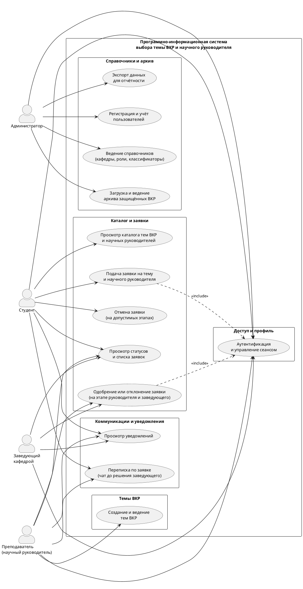
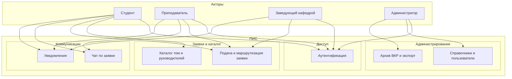

# Диаграмма вариантов использования ПИС выбора темы ВКР

Материал для пояснительной записки: согласуется с описанием системы в `Архитектура_программно_информационной_системы_ВКР.md`, `Системный_анализ_и_аналоги_ВКР.md` и с организационными требованиями к этапу выбора темы и руководителя из положения П-8.2.3.2/8.3.4-01-2020 (раздел 4.2: перечень тем кафедры, выбор темы обучающимся, заявление с темой, согласованной с руководителем ВКР, утверждение тем; раздел 4.3 — роль руководителя ВКР). Функции, выходящие за рамки прототипа (антиплагиат, ЭБС, ГИА), на диаграмме не показываются — это границы системы, зафиксированные в архитектурном разделе.

**Рекомендация по вставке в Word:** экспортировать UML-рисунок из PlantUML ([plantuml.com/plantuml](https://www.plantuml.com/plantuml) или плагин в IDE) в PNG/SVG, подписать по стандарту оформления кафедры, например: «Рисунок 2.x — Диаграмма вариантов использования ПИС».

---

## Акторы

| Актор | Назначение |
|--------|------------|
| Студент | Обучающийся: выбор темы и научного руководителя, подача и отслеживание заявки, переписка по заявке до финального решения заведующего |
| Преподаватель (научный руководитель) | Ведение тем ВКР, рассмотрение заявок, переписка со студентом в контексте заявки |
| Заведующий кафедрой | Итоговое утверждение или отклонение заявки после согласования с руководителем (организационный контур, соответствующий п. 4.2.7–4.2.8 положения) |
| Администратор | Учёт пользователей, справочники, архив защищённых ВКР, экспорт для отчётности |

---

## Связь вариантов использования с нормативным контекстом (кратко)

- **Подача заявки и одобрение или отклонение заявки** (один вариант использования для обоих этапов: научный руководитель и заведующий кафедрой) отражают электронный аналог цепочки «согласование с руководителем ВКР → рассмотрение заведующим выпускающей кафедрой» (п. 4.2.7, 4.2.8).
- **Каталог тем** соответствует идее перечня тем, формируемого выпускающей кафедрой (п. 4.2.1); поддержка собственной темы студента — п. 4.2.4.
- **Архив ВКР** поддерживает учётно-отчётный контур после защиты; размещение в ЭБС в положении регламентируется отдельно и в прототип не входит.

---

## Диаграмма (PlantUML, UML Use Case)

Скопируйте блок ниже в редактор PlantUML и сохраните как изображение для пояснительной записки.

**Как уменьшить «кривизну» и пересечения связей.** На публичном сервере [plantuml.com](https://www.plantuml.com/plantuml) строка `!pragma layout elk` нередко приводит к сбою (`UnsupportedClassVersionError` в модуле ELK из‑за версии Java на сервере), поэтому в приведённом коде используется обычная раскладка **Graphviz** с увеличенными `nodesep` и `ranksep`. Актор «Администратор» объявлен **после** границы системы, чтобы он чаще оказывался **справа** от прямоугольника и его связи не пересекали веер связей студента, преподавателя и заведующего слева. Если линии всё ещё густые, попробуйте `top to bottom direction` вместо `left to right direction` или локальный PlantUML/JAR с новой JVM; ELK при этом можно снова включить только локально строкой `!pragma layout elk`.

---

## Упрощённая схема для Markdown-просмотра (не заменяет UML в записке)

Ниже — ориентир по связям «актор — подсистема»; для официального рисунка в ВКР используйте PlantUML выше.

---

## Примечания для защиты

1. Один сценарий «Подача заявки» в коде может различать тему из каталога и индивидуальную формулировку; на уровне варианта использования это один прецедент с альтернативными потоками.
2. Связь `<<include>>` с «Аутентификация» подчёркивает, что критичные операции выполняются только в авторизованном сеансе (согласуется с разделом безопасности архитектуры).
3. При необходимости сократить рисунок для полосы набора можно объединить «Просмотр статусов» и «Просмотр уведомлений» в один вариант «Работа с заявками и оповещениями» для студента и преподавателя.
